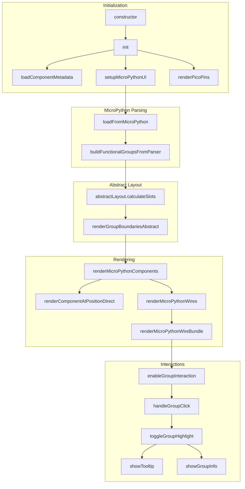

# Diagram 1: Active MicroPython Flow (KEEP)

This shows the code paths that ARE actively used when parsing MicroPython code in `explorer-app.js`.

## Edit Link
[Open in Mermaid Live Editor](https://mermaid.ai/live/edit?utm_source=mermaid_mcp_server&utm_medium=remote_server&utm_campaign=claude#pako:eNqFU01r3DAQ_SuL7wl413vpobC2lHahAdOm9NDtQSsrtoiiMfogpKX_vfqq61ka1mCsmffmzbyx_aviMIjqXfWo4IVPzLjNQ3vSm3BZfx4Nm6fNUUv3_VTFh2RK_mROgj5VPzItXoc64By0dcZzBwaD2wDKUIyzu5BVwIYOnmfQQrt74djAHMO0JtCscH6-l9xA_-om0F-PmLMPHCP0IEwvOfRS2wUP2Xy48NQzY0UoW6mmnNQj0m7rMuadgecVGZOiw7OXarjzmsftMPXBgJ9trEqtzNWJPrFX8HHPh3NYI-OuZFCnLo7DCiHjt5wp7hVz4osCZzF9u2wmzdOC1wMzUti_Ta6O9TlVB5l8uNwPqZcOq-0s7xSPQ_6NszAOrgcr486INIJju2T3P_VvgXgh3LzFa4NhJa66PGon4jrSZ56PYSLchEarQrOzEmmZKyLmRZcTi30Tr1OSP2FGtOVgHAvjoxwnFW5snqZPf4KXBwDl5IzBfQHLKI_wlsdDvbm5eR_-whJuc7jDYYPDPVJoUrKtc9hmwbYItrmkK2iX0a6gXUZJQUlGyRaHZRiyy2Gz7k5yd1oUaC6hRYFmfVoUaFagDQ731e8_tD11AQ)

## Created
December 18, 2025
