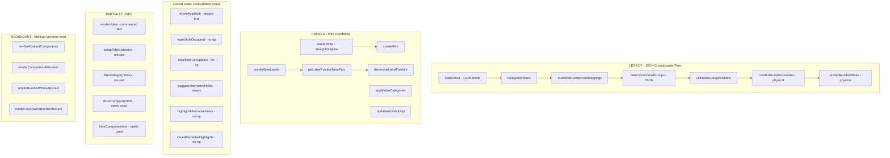

# Diagram 2: Legacy/Unused Code (REMOVE)

This shows code inherited from the guided wiring system that's no longer used in `explorer-app.js`.

## Edit Link
[Open in Mermaid Live Editor](https://mermaid.ai/live/edit?utm_source=mermaid_mcp_server&utm_medium=remote_server&utm_campaign=claude#pako:eNqNlG9v0zAQxr-K1fcFbf0ziRdIWbeOQeiqrQFNjBdOckstnDhy7I2A-O7cOU5Wt52gr3rx77k7Pz779yhTOYzejR6les62XBu2OX-oGP4amxaa11sWQ8Gz9tvDKL68ihb3bMw-3t2s2ELozAoTK56DZkvUP4y-d1L6xSeokLjouV5WYr0QPEUw4wYKpcUv-Co0NCEwQSC1Qua0tlBlrSqozGde16Iq9tgpsjkYyMzSVpkRquLySitbN76BEJ-52jKzEhtw3Fo1gmR7eecIaqhwq446V7bKuRZAaett2wjMEirOBsU5shJc90dxhLo_e8YnlW0gxzTJKrm7vEAppWC3LiluPaiXnAz1HDVmjdFcFFvztlaylaIKbU-c7Rpw38SHa5MgV8xTkKEfCflcgHFLvWUr4HotMhWSM38iusQWHL9U-rAkGYwnKlt3yH4c9iYhIU9tnfuev4hGpEIK0_7TSpoablAdTm332Sdhd8amYcEFmSqaD0pC9MSF5KkkZ7l85m3DjLbhJhbkacn1DxLcZJmtBeTIV2qs6pAkhzOJhg0oJwuPw2R2Y4sCGhNJdLJC9glISfMEZb3jgBOQ51s8e0nnf0RypMa8b2gX71Mcal4zeo1PiOASk62j2811FMf3jIY3KLZ-mdW-o0yVJV5qtEtZE8JkagPG1ktBrcWiMVCBJpV1NyTEydlHR_opajfqE7Sv0M7arXoenpXr6lEhq7kG2bJDQWdtDv8jeM2kKKW7mdE83l5eJKuLaLXBFP1n9oS7oyeIwU_cbFA_erGux4dOwtmNTgdyICLT39UQnRx9q_oCITsNX0IiO9EBvrf9-ISNx-_xvffhaRdOfDjpwqkPp1048-GsC-c-nHfh2W7-BPO_wa-JL5BMfOxTJlMfz0Z__gLoAypc)

## Created
December 18, 2025
