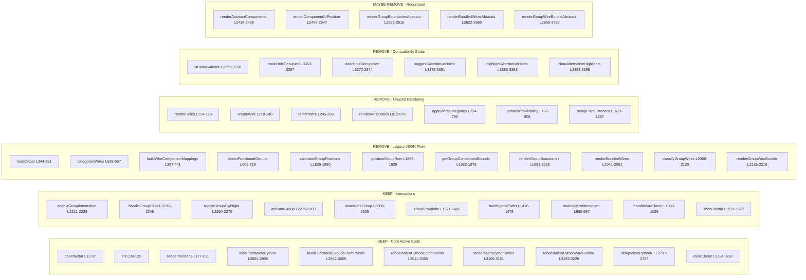

# Diagram 3: Complete Cleanup Guide with Line Numbers

Comprehensive view of `explorer-app.js` showing what to KEEP vs REMOVE, with approximate line numbers.

## Edit Link
[Open in Mermaid Live Editor](https://mermaid.ai/live/edit?utm_source=mermaid_mcp_server&utm_medium=remote_server&utm_campaign=claude#pako:eNqNVu9vo0YQ_VeQvyOxP2DZfnOipHHPbizcu7pq-mENG7w6wlqw5JSe-r93BoPNokR3lhIj-b2dmTdvZvm-yG2hF78sniv7LT-qxgXr7KkO4NN2h7JRp2Pw6e5u-_fTAr-CMLi1jQ6WuTOvGp4L_bT454zHzycCwNzWrWu63NkmWBMaSuFjKGBMbSCSlCFhsf8rg18bXRe62Zrcbk3dwiFChJQQH8gBWFlV3Df2ZWPyxm7f3NHWwZqmEQ-pjGYHx4A_dKYq7rsa0re1qn5tbHdq8YCtaloN6VLJaciiOTe5JDWJdGtfTrbWtYMMWUQI8OLI54n3eH-aRiOFRDJkJJ6VlX5EuenqotLIi4FHqfR5Enitdt1pQvu8gooEA_HEvAkkwk5VWjW3psk77AajjMPByRUJaZwf3nEEvVpiVTvdqF7T1ouyQjvoWh0q3Us9AUJilJKQzutY4blHhaX2lNvK5F8RzGIAc78vKzSLs2U5gB9MeazgzyEhjoAg_Ias0DSYwKtyZwoiBRzNIuYj0S6FnmNZlAJ25tkV2qM92m9Dkc8WLMsECQmPEh8pRhPuTAkG3Cp3RH9zkgBYpD44vaiH_ffEk2kUytTv6UpepEP8g31FR5MIUiYRnSXS9x9z_sPayhmoDZwI4xiLH7c_u9s8frkD_vkBHLDWpcrfgt92j78H97BJvFgZGSb16jQORpO-8TNsfA5Sl7Yx_-phSGKWhnHs15mxUUQEXaZwo04nU5c4WVKEnM-O530_nc7dfP6DdQKTKIivfhb3-VR5V43939rW9CYHsVIKHUtT314ZGuE0oHpKZr8hOI1DIqnvmgy9UGp3tvlYxY2FMccAklHgCL9t2XU79LQerRqje0YK8zRvdCYvjPMCKQZlacQRnsxkGvaCalvz_NbHuOCTBJYwm1VMiJ_RdFMBGoeWJD_pKDq11Oe6a3URZP3R0Fcv7P4a9cFWffUxD4nwFd73lmo09A_TwoRgerlfwf564QwgDkkn_lbacw-0VgddQdAUbrd01qI9-gasWL317hwMjSkKwUMhZ9HRMd2pGFL8YlpzMJVxbwCXcHjkm3Ivxi1_bypYB2vTOl3rBgVIBAtJIn92fNlUbLSfcmPonesO_iLfod6mRa2Xr8pUuJNgzlgch_DPz3GHqr-o5iuiH_O8OxnoI4ATBuDEn-UdG6-hC1qdNxxjAm5iJriPx0a0XVnq1i1RgVrhm8hgAoDD1chS39M77MhxvBreY6UJsmZlJGNmU8Z4Sk-TWJCMfyj4ZvnXDa7L_ju4iJ7pAqe3dl7czdXaywO8R8HGn75oUN57eJbshl5IF_DSjfsKWRKGN-a--Bv20TYZIwMzjimMA_FNvuHvbpUJLaFIm70PbeKPlsWUCaaCl5ZoKuviv_8BEK0hqg)

## Summary: Estimated Line Reduction

| Category | Lines | Description |
|----------|-------|-------------|
| **REMOVE - Legacy JSON Flow** | ~400 | `loadCircuit`, `categorizeWires`, `detectFunctionalGroups`, physical layout methods |
| **REMOVE - Unused Wire Rendering** | ~150 | `renderHoles`, `createWire`, `renderWire`, `renderWireLabels`, filter methods |
| **REMOVE - Compatibility Stubs** | ~40 | `isHoleAvailable`, `markHoleOccupied`, etc. (L3355-3395) |
| **MAYBE REMOVE - Redundant** | ~300 | Abstract methods duplicated by MicroPython-specific versions |
| **Total Removable** | **~890 lines** | ~32% of the 2800-line file |

The file could potentially be reduced from **~2800 lines to ~1900 lines** by removing the legacy guided wiring code.

## Created
December 18, 2025
