# Diagram 4: CORRECTED - Two Parallel Code Paths

**Important Finding:** The "legacy JSON flow" is NOT legacy - it's still actively used by `circuits-manager.js` when loading JSON circuits from the side panel!

## Analysis from Console Log (Dec 18, 2025)

### MicroPython Flow (your console trace):
```
loadFromMicroPython (L2805)
  → clearCircuit (L3266)
  → buildFunctionalGroupsFromParser (L2997)
  → abstractLayout.calculateSlots (L249)
  → renderGroupBoundariesAbstract (L2559)
  → renderMicroPythonComponents (L3049)
  → renderMicroPythonWires → renderMicroPythonWireBundle (L3228)
```

### JSON Flow (called by circuits-manager.js line 302):
```
loadCircuit (L344)
  → categorizeWires (L538)
  → buildWireComponentMappings (L397)
  → detectFunctionalGroups (L609)
  → calculateGroupPositions (L1826)
  → renderGroupBoundaries (L1981)
  → renderBundledWires → renderGroupWireBundle (L2041)
```

## The Corrected Diagram

```mermaid
flowchart TB
    subgraph MicroPython["MICROPYTHON FLOW - Active Primary"]
        MP1["loadFromMicroPython L2804"]
        MP2["clearCircuit L3234"]
        MP3["buildFunctionalGroupsFromParser L2942"]
        MP4["abstractLayout.calculateSlots"]
        MP5["renderGroupBoundariesAbstract L2552"]
        MP6["renderMicroPythonComponents L3011"]
        MP7["renderMicroPythonWires L3109"]
        MP8["renderMicroPythonWireBundle L3159"]
    end

    subgraph JSON["JSON FLOW - Used by circuits-manager"]
        J1["loadCircuit L344"]
        J2["categorizeWires L538"]
        J3["buildWireComponentMappings L397"]
        J4["detectFunctionalGroups L609"]
        J5["calculateGroupPositions L1826"]
        J6["renderGroupBoundaries L1981"]
        J7["renderBundledWires L2041"]
        J8["classifyGroupWires L2066"]
        J9["renderGroupWireBundle L2135"]
    end

    subgraph Shared["SHARED - Used by Both"]
        S1["constructor L12"]
        S2["init L99"]
        S3["renderPicoPins L177"]
        S4["enableGroupInteraction L2221"]
        S5["toggleGroupHighlight L2250"]
        S6["showGroupInfo L1371"]
        S7["showTooltip L1519"]
    end

    subgraph SafeRemove["SAFE TO REMOVE"]
        R1["renderHoles L154 - commented"]
        R2["createWire L218"]
        R3["renderWire L245"]
        R4["renderWireLabels L812"]
        R5["setupFilterListeners L1673"]
        R6["isHoleAvailable L3355"]
        R7["markHoleOccupied L3363"]
    end

    subgraph MaybeRemove["REDUNDANT - MicroPython has own"]
        M1["renderAbstractComponents L2418"]
        M2["renderComponentAtPosition L2496"]
        M3["renderBundledWiresAbstract L2622"]
        M4["renderGroupWireBundleAbstract L2655"]
    end

    MP1 --> MP2
    MP2 --> MP3
    MP3 --> MP4
    MP4 --> MP5
    MP5 --> MP6
    MP6 --> MP7
    MP7 --> MP8

    J1 --> J2
    J2 --> J3
    J3 --> J4
    J4 --> J5
    J5 --> J6
    J6 --> J7
    J7 --> J8
    J8 --> J9
```



## Edit Link
[Open in Mermaid Live Editor](https://mermaid.ai/live/edit?utm_source=mermaid_mcp_server&utm_medium=remote_server&utm_campaign=claude#pako:eNp9VduO2jAQ_ZWIdypyJfShEuxCqcVNhO2qKn0wjgGrIUa2syta9d87ThzA1u5GQiijM3Psc2YmfzuE57TzubMv-Cs5YqG8zWhbevDIancQ-Hz05owIvrqoIy9_bjvzbw_r5erHZrpceJPZ8tnrekOi2Av1VoKdsLhsO7-aAvqZr3zIKTjOJ4Kf7ip5syDtRQ42ACwpKBYPTJCKKW8WBqELCgG0q1iRT6oSiHmJi6-CV2epGVZYSCqg-CAKnLwI8vBOKoGJmuELr9QnggtSFVjRrOBKOvgY8IKWORV1-RGvyhwLRuXQFAGWOHZZkmvW3WUf-OnMS1oqCTfq-b6T038r55kJquF-b-DA0_fgIzhhQXVOfMsB4LZ0HEXZcgFF9F_r4ZOkube7eKRRXnZPuMQHKixu1Jp58yey7UG1haDogQv2h5pLxGFqo64easBVnTk-n1l50Lce9O0EbV5OFSXKdd2bJY5CKK7PYKytUSsumU4CtJ8GiQ1P3jMawIPUNgvdvGrUzs0Vg17kINO6mbGUbH-pC1-RiXOAgX2AeysDP4w_tDKDmaU5FMimw_X48c7JEVdHiyfT7hEQQYmKKA5T4tvdm2nzWKl9HdiSZuH1iCtG-IrVSvZtkzJtEi3xrmhE_1YqqueE1dMeBLY-mXZJ8cPBoKfscCzgp8cqiHs2Vlskj_zV1N1zYA_7TsG-AW04LxQ7AyT2P56DDO_pmp74C9UCDidjb7P01uP58vvYKr32r9ef8qJujDgCqQk_naBvaW6j6xkQFJpPW6lNtNt_fVPTAKLYBkQWYIZ3tADS1PFrrSWUVFXnCStA6xmTipZU6PMl_dDGagmZ1McfvmBWaJdgzsLYYdYiwhb_rYFLQqozg24CXBJ-qOQcX3Y3KaERnxaPw8UGNLrf-UcsPf5a2vvspm27WO_XZRA54s2DK_6KG6p2wHXCwB6vefjmyN5t8SRwtnj03kDeJ8VvDiZ88Lxu94v-mLWBwATCNhCaQNQGIhOI20BsAkkbSEyg3wb6JpC2xKjhRYYWNazIkKKGExlK1DAiQ4gaPmToUMOGDBlquFBqXtPmddD59x9_QXMA)

## Key Decision Point

**Question for you:** Do you still want JSON circuit loading capability from the circuits-manager side panel?

| If YES (keep JSON loading) | If NO (MicroPython only) |
|---------------------------|--------------------------|
| Keep the entire JSON flow | Remove ~400 lines of JSON flow |
| Total removable: ~190 lines | Total removable: ~590 lines |
| File size: ~2600 lines | File size: ~2200 lines |

## Revised Safe-to-Remove List

These are safe to remove regardless of your decision:

| Function | Lines | Reason |
|----------|-------|--------|
| `renderHoles` | L154-175 | Commented out, never called |
| `createWire` | L218-240 | Not used in bundled wire mode |
| `renderWire` | L245-269 | Not used in bundled wire mode |
| `renderWireLabels` | L812-876 | Replaced by group labels |
| `setupFilterListeners` | L1673-1697 | Filter UI not used |
| `filterCategoryToKey` | L1699-1706 | Filter UI not used |
| `isHoleAvailable` | L3355-3358 | No-op stub |
| `markHoleOccupied` | L3363-3367 | No-op stub |
| `clearHoleOccupation` | L3372-3374 | No-op stub |
| `suggestAlternativeHoles` | L3379-3381 | No-op stub |
| `highlightAlternativeHoles` | L3386-3388 | No-op stub |
| `clearAlternativeHighlights` | L3393-3395 | No-op stub |

**Total safe removal: ~190 lines**

## Created
December 18, 2025
